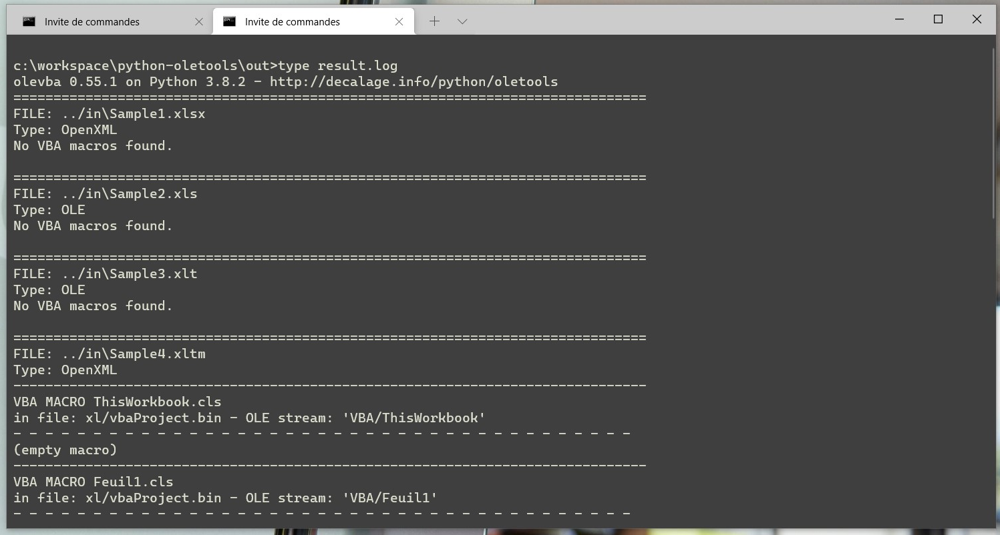
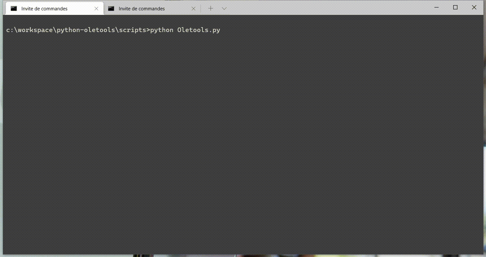

# Python Oletools

This project aims to inspect the VB code present in the Excel files.
This allows you to quickly have an overview of the code present in these files and to hunt down "wild" extractions, CRUD operations via OLEDB or ODBC connections, ...

[](http://forthebadge.com) [](http://forthebadge.com)  [](http://forthebadge.com)  [](http://forthebadge.com)  [](http://forthebadge.com)


## Get started with Oletools

1. Install Python (if you haven't already)
2. Clone this repository
3. Install OleTools

```bat
pip install -U oletools
```

4. Configure the scan (directory & file pattern) through the oletools.ini file
5. Execute Oletools.py

```bat
Python Oletools.py
```

The script will expose in the /out/result.log folder the VBA contents of each scanned file.
Analysis logs are available in the /log/vba-inspect.log folder





## Build with

* [Python](https://www.python.org/) - Programming language
* [OleTools](http://www.decalage.info/python/oletools) - Tools developed in Python to analyze OLE files and Microsoft Office files
* [Git](https://git-scm.com) - Open source distributed version control system

## Contributing

If you would like to contribute, read the CONTRIBUTING.md file to learn how to do so.
